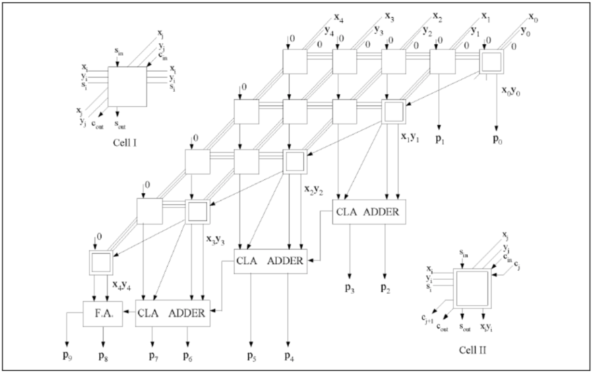
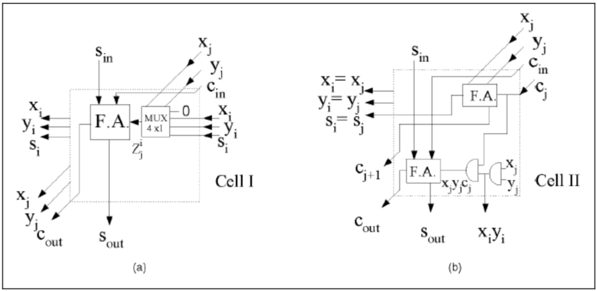
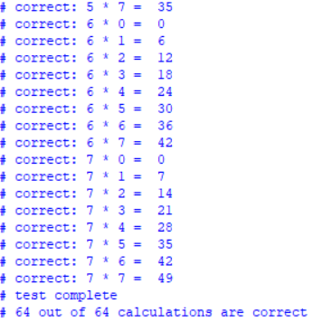
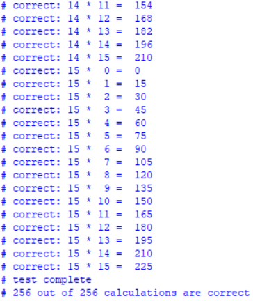
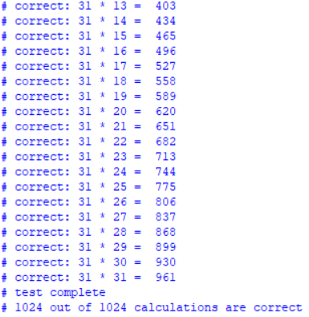
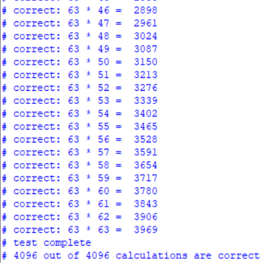
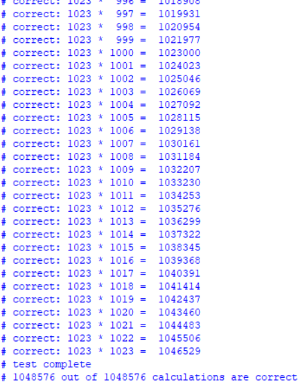

# Mux-Based-Multiplier
Verilog test code for SSRL multiplexor based multiplier research project

## Logic Design
Top level logic diagram for a 5 by 5 multiplier:

Logic diagram for Cell I and Cell II:

## Some Results
Screenshot of the 3 by 3 multiplier result, all tests pass:

Screenshot of the 4 by 4 multiplier result, all tests pass:

Screenshot of the 5 by 5 multiplier result, all tests pass:

Screenshot of the 6 by 6 multiplier result, all tests pass:

Screenshot of the 10 by 10 multiplier result, all tests pass:

